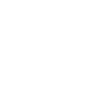

### Hi 👋 my name is Kevin Foreman

I'm a full stack developer

---

- 🌍 I'm based in Colorado
- 🖥️ See my portfolio at [kevin-foreman.github.io/Personal-React-Portfolio/](https://kevin-foreman.github.io/Personal-React-Portfolio/)
- ✉️ You can contact me at [kevin.o.foreman2@gmail.com](mailto:kevin.o.foreman2@gmail.com)
- 🤝 I'm open to collaborating on interesting projects as a developer
- ⚡ I served in the military for 21+ years!

### Skills

  <!--  -->

<!--
**kevin-foreman/kevin-foreman** is a ✨ _special_ ✨ repository because its `README.md` (this file) appears on your GitHub profile.

Here are some ideas to get you started:

- 🔭 I’m currently working on ...
- 🌱 I’m currently learning ...
- 👯 I’m looking to collaborate on ...
- 🤔 I’m looking for help with ...
- 💬 Ask me about ...
- 📫 How to reach me: ...
- 😄 Pronouns: ...
- ⚡ Fun fact: ...
-->
